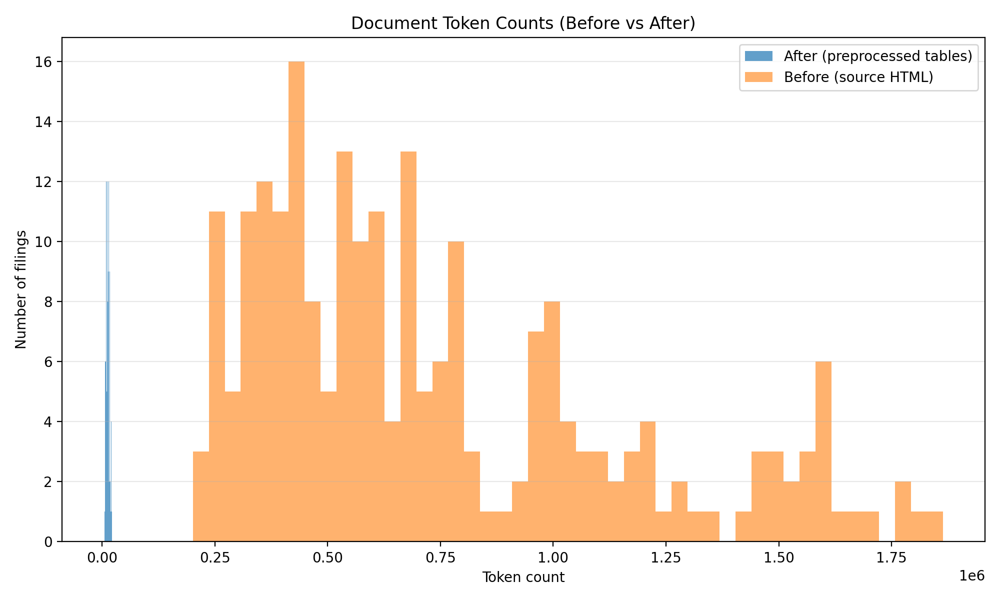
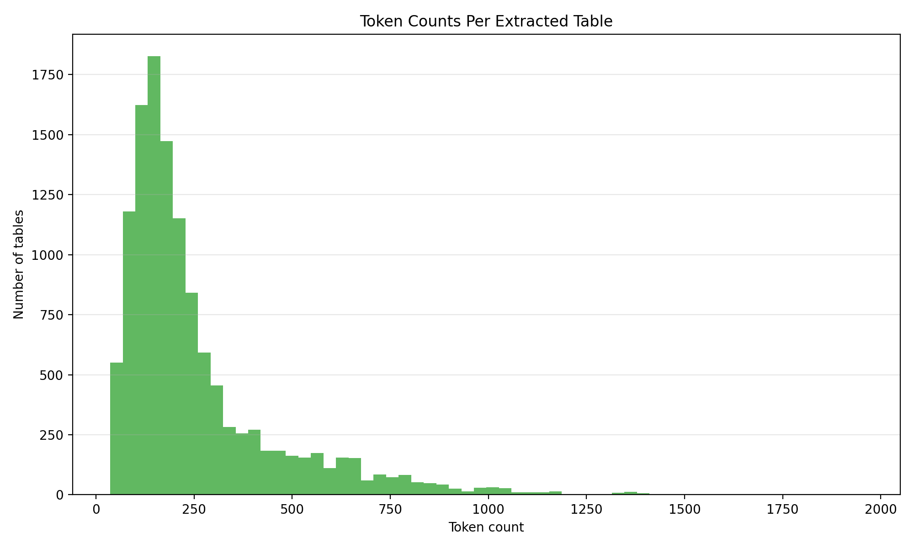
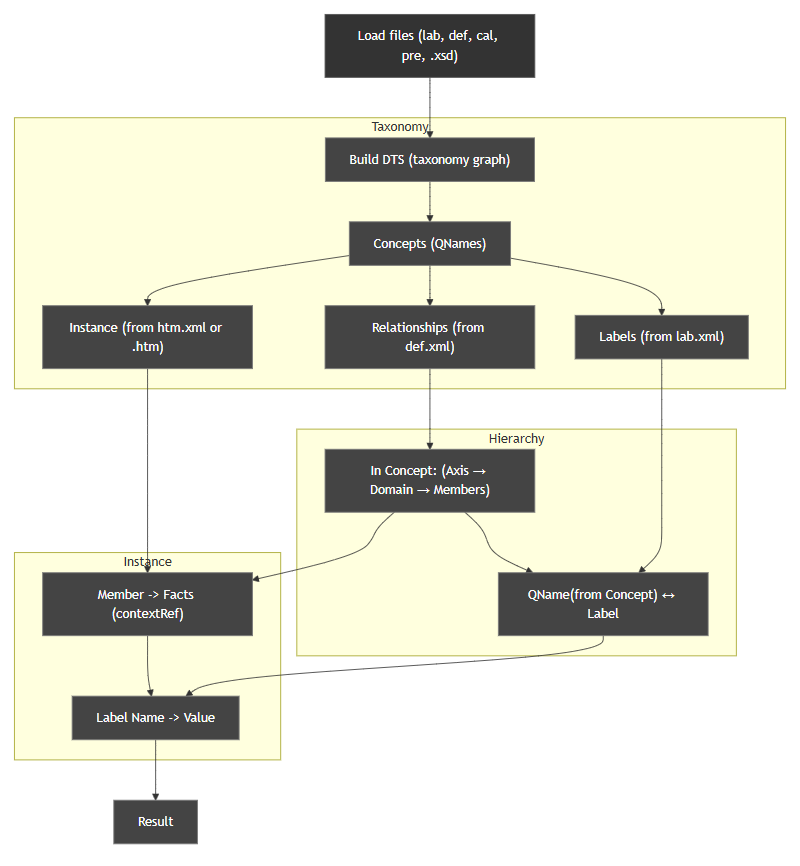
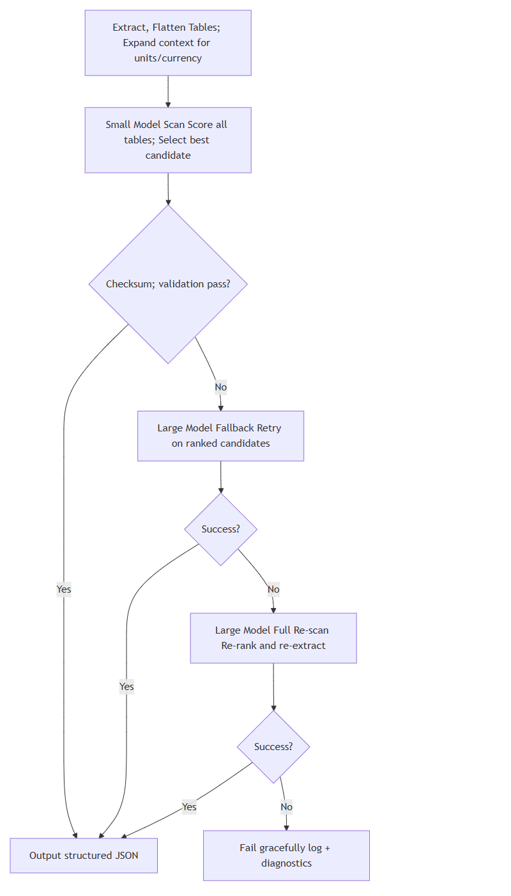

# Revenue Segment Extraction Pipeline

This project automates revenue-by-segment extraction from SEC 10-Q and 10-K filings.  
Raw filings are downloaded, normalized into table-centric chunks, processed with large language models, and validated before publishing JSON summaries per company and period.

- **Async LLM extraction** – `models/scraper.py` streams chunks through configurable agents (Ollama locally, OpenRouter for meta fixes) and writes structured `RevenueData` JSON.
- **Rich preprocessing** – `preprocessors/chunker.py` converts messy EDGAR HTML into clean, table-first JSON slices.
- **Data quality gates** – `security/pre_scan.py` and `security/post_scan.py` catch missing filings, duplicate periods, and mismatched totals.
- **Caching** – candidate chunks and prediction histories live under `result/<TICKER>/`, enabling manual review and iterative corrections.

## Repository Layout
- `example` - show how to extract revenue of product segment from ixbrl format
- `preprocessors/` – HTML chunking, label normalization, and cleanup scripts.
- `models/scraper.py` – main async extraction loop and quality refinement.
- `screw/` – LLM agent wrappers, retry logic, and throttled API helpers.
- `security/` – pre/post run validation utilities.
- `utils/` – data downloaders, API helpers, XBRL converters, path mappers.
- `result/<TICKER>/`  
  - `candidates/<PERIOD>/chunks/*_candidated_chunks.json` – chunk caches.  
  - `candidates/<PERIOD>/predictions/*_prediction_history.json` – first-pass outputs per chunk.  
  - `predictions/*_prediction.json` – final reconciled `RevenueData` records.

## Prerequisites

- Python 3.10+ (async features and typing syntax rely on 3.10).
- A working [Ollama](https://ollama.com/) install (default local inference target) or an HTTP-compatible chat completion endpoint.
- Optional: [Arelle](https://arelle.org) for inline XBRL cleanup (used by `utils/fetch_data.py` and `utils/utils.py`).

Manage dependencies and virtual environments with Poetry (recommended).

Install Poetry (if you don't have it):

```bash
# macOS (Homebrew)
brew install poetry
# or the official installer
curl -sSL https://install.python-poetry.org | python3 -
```

Create a virtual environment and install dependencies using the existing `pyproject.toml`:

```bash
# From the project root (macOS / zsh)
poetry install

# Activate a shell with the project's virtualenv
poetry shell

# Or run a single command inside the venv without activating the shell
poetry run python main.py
```

If you don't yet have a `pyproject.toml`, you can create one and add dependencies:

```bash
poetry init --no-interaction
poetry add aiohttp requests beautifulsoup4 html5lib pandas tenacity rapidfuzz tqdm click python-dotenv json5 arelle
```

Create a `.env` file with any remote API secrets (used by the app when loaded):
```text
api_token = YOUR_API_TOKEN
```

## End-to-End Workflow

1. **Download SEC master indexes**  
   ```powershell
   python utils/downloads_master.py --start 2020 --end 2025 --out master_files
   ```
   Adjust `START_YEAR`, `END_YEAR`, and headers if needed.

2. **Fetch filings**  
   Configure `STARTY`, `ENDY`, `NUM`, and `TICKER_PATH` near the bottom of `utils/fetch_data.py`, then run:
   ```powershell
   python utils/fetch_data.py
   ```
   This downloads raw submissions and extracts HTML/XBRL into `data_new/<TICKER>/<YYYY-QQ-01[K]>/*.htm`.

3. **Chunk filings into JSON**  
   ```powershell
   python preprocessors/chunker.py data_new
   ```
   Outputs go to `preprocessed/<TICKER>/<PERIOD>/*.json`. These JSON files are the input for the extractor.


   **Stat of chunking**
   - Average tables per filing: 52.54
   - Median token reduction ratio (after / before): 0.019

   **Histogram**
   Distribution of token before and after:
   

   Distribution of tokens in tables
   


4. **Pre-run sanity check (optional)**  
   ```powershell
   python security/pre_scan.py --src preprocessed
   ```
   Reports missing JSON conversions per ticker/period.

5. **Run the extractor**  
   ```powershell
   python main.py
   ```
   **Extraction Framework - IXBRL**
   

   - Uses `MAX_CONCURRENT = 3` to throttle async calls.
   - `Extractor` defaults to Ollama (`http://localhost:11434/api/chat`) with `qwen2.5-coder:14b`.
   - Meta re-processing switches to OpenRouter (`openai/gpt-oss-20b:free`) when post-run fixes are required. Provide `api_token` in `.env`.
   
   **Extraction Framework - LLM**
   

6. **Post-run validation**  
   ```powershell
   python security/post_scan.py
   ```
   The script flags duplicate periods, empty metadata, and total/segment mismatches. `error_records.json` and console output list files that need manual review.

7. **Manual fixes (optional)**  
   - `security/find_missing.py` compares candidate vs prediction inventories.
   - `preprocessors/remove.py` demonstrates safe cleanup for known-bad files (e.g., TSLA legacy filings).

## LLM Configuration Tips

- Toggle local vs remote inference by calling `Extractor.set_ollama(True/False)`. The main run starts with Ollama and switches to OpenRouter for remediation.
- Update the base model or endpoint via `Extractor.update_source(model_name, base_url)`.
- `screw/meta_agents.AsyncThrottleOpenAI` provides rate limiting if you integrate additional HTTP endpoints.
- Ensure Ollama has the target model pulled (`ollama pull qwen2.5-coder:14b`) before running `main.py`.

## Data Contracts

Final predictions conform to `schema/data.py`:

```python
RevenueData(
    period: str,          # period label, e.g. "2024-06-30"
    currency: str,        # "USD", defaults in post-processing if missing
    scale: str,           # "thousand", "million", etc.
    product_segments: Dict[str, float],
    total_revenue: int,
    reasoning: str        # short text justifying the extraction
)
```

All predictions are JSON-serialized using `dataclasses.asdict`, so downstream consumers can rely on consistent keys.

## Troubleshooting & Quality Checks

- `result/<TICKER>/candidates/*_candidated_chunks.json` keeps the raw chunk text used for a prediction; inspect these when a result looks off.
- `error_records.json` (generated by `models/scraper.run_prediction`) aggregates files that failed initial passes.
- Set `verbose=True` in `security/post_scan.get_error_table` to print every duplicate or mismatch during debugging.
- When remote APIs return malformed JSON, `utils/utils.extract_json` will raise helpful diagnostics—check console logs for truncated payloads.

## Contributing

1. Keep changes ASCII-only unless files already contain Unicode (mirrors the existing code style).
2. Prefer `apply_patch` or small, focused commits—several scripts expect deterministic filenames.
3. Run `pre_scan`/`post_scan` before submitting changes to ensure data completeness.

Feel free to open issues or PRs with new tickers, additional validation rules, or integration ideas for alternative LLM providers.
